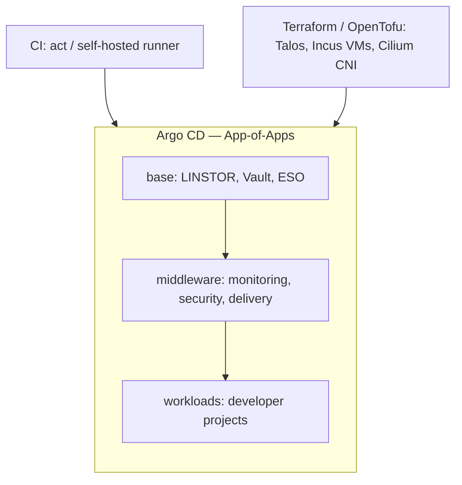

# Atlas IDP

**Internal Developer Platform — GitOps-driven Kubernetes platform engineering**


## Table of Contents

- [Architecture](#architecture)
- [Tech Stack](#tech-stack)
- [Repository Structure](#repository-structure)
- [Quick Start](#quick-start)
- [CI/CD Pipeline](#cicd-pipeline)
- [Golden Path — Workload Onboarding](#golden-path--workload-onboarding)
- [Security & Policy](#security--policy)
- [Observability](#observability)
- [Testing](#testing)
- [Environments](#environments)
- [Roadmap](#roadmap)
- [License](#license)

Atlas IDP is a production-grade, cloud-native Internal Developer Platform (IDP)
monorepo built as a DevOps/platform-engineering portfolio project. It demonstrates
an end-to-end platform: Infrastructure as Code, GitOps delivery, progressive
delivery, policy-as-code, supply-chain security, secrets management, observability
and disaster recovery — running locally on a **Talos Linux** Kubernetes cluster
provisioned on **Incus** VMs, following production patterns.

A sample tenant workload, **seal** (a PDF signing service: API + UI + worker),
is onboarded through the platform's golden path (`atlasctl`) to exercise every
capability end-to-end.

---

## Architecture



<details>
<summary>Legacy ASCII architecture diagram</summary>

```text


┌──────────────────────────────────────────────────────────────────┐
│                     CI/CD — GitHub Actions                         │
│   run locally on a self-hosted runner or via `act` (nektos)        │
│   ci-base  ──▶  ci-middleware  ──▶  ci-workload   (ci-all)          │
└──────────────────────────────────────────────────────────────────┘
                               │
┌──────────────────────────────┴───────────────────────────────────┐
│                       GitOps — Argo CD                             │
│   App-of-Apps:  root-app ──▶ platform layers ──▶ workloads         │
│   layers: base · storage · security · delivery · observability     │
└──────────────────────────────────────────────────────────────────┘
                               │
┌──────────────────────────────┴───────────────────────────────────┐
│                Kubernetes runtime — Talos Linux                    │
│   ┌─────────┐ ┌──────────┐ ┌──────────┐ ┌──────────┐ ┌─────────┐  │
│   │ Cilium  │ │  Argo    │ │ Kyverno  │ │  Vault + │ │ KEDA +  │  │
│   │ CNI+GW  │ │ Rollouts │ │ (policy) │ │   ESO    │ │ metrics │  │
│   └─────────┘ └──────────┘ └──────────┘ └──────────┘ └─────────┘  │
│   ┌─────────┐ ┌──────────┐ ┌──────────┐ ┌──────────┐ ┌─────────┐  │
│   │ Piraeus │ │ CloudNat.│ │  MinIO   │ │  Velero  │ │  Trivy  │  │
│   │ LINSTOR │ │ PG/Redis │ │  (S3)    │ │   (DR)   │ │Operator │  │
│   └─────────┘ └──────────┘ └──────────┘ └──────────┘ └─────────┘  │
│   Observability: Prometheus · Grafana · Alertmanager ·            │
│                  Loki · Tempo · Grafana Alloy                      │
│   Workload (seal): seal-api · seal-ui · seal-worker · dlq CronJob  │
└──────────────────────────────────────────────────────────────────┘
                               │
┌──────────────────────────────┴───────────────────────────────────┐
│               Infrastructure — Terraform / OpenTofu               │
│   Incus/Talos VMs (stage, active)                                                  │
└──────────────────────────────────────────────────────────────────┘
```

</details>

---

> More diagrams — secrets, network, CI/CD and observability flows:
> [`docs/cv/diagrams.md`](docs/cv/diagrams.md).

## Tech Stack

| Category                 | Tools                                                          |
| ------------------------ | -------------------------------------------------------------- |
| **Infrastructure**       | Terraform / OpenTofu, Incus (local VMs)                        |
| **OS / Kubernetes**      | Talos Linux, Kubernetes v1.34                                  |
| **CNI + Ingress**        | Cilium (kube-proxy-less) + Gateway API                         |
| **GitOps**               | Argo CD (App-of-Apps)                                          |
| **Progressive delivery** | Argo Rollouts (canary)                                         |
| **Autoscaling**          | KEDA + metrics-server (HPA)                                    |
| **CI/CD**                | GitHub Actions (self-hosted runner / `act`)                    |
| **Observability**        | Prometheus · Grafana · Alertmanager · Loki · Tempo · Alloy     |
| **Secrets**              | HashiCorp Vault + External Secrets Operator                    |
| **Storage**              | Piraeus / LINSTOR (replicated block), snapshot-controller      |
| **Databases**            | CloudNativePG (PostgreSQL), Redis                              |
| **Object storage**       | MinIO (S3-compatible)                                          |
| **Policy-as-code**       | Kyverno                                                        |
| **Supply chain**         | Cosign image signatures (enforced via Kyverno), Trivy Operator |
| **Backup / DR**          | Velero                                                         |
| **Platform tooling**     | `atlasctl` (Go CLI — golden-path workload onboarding)          |
| **Languages**            | Go · HCL · YAML · Shell                                        |

---

## Repository Structure

```
atlas-idp/
├── apps/                       # Application source + Helm charts
│   └── seal/                   #   Sample tenant workload (API/UI/worker) + chart
├── gitops/                     # GitOps manifests (Argo CD)
│   ├── bootstrap/
│   │   └── root-app.yaml       #   App-of-Apps root Application
│   ├── platform/
│   │   ├── layers/             #   Layer Applications (base/storage/security/…)
│   │   ├── base/               #   Cilium Gateway, routes, network policies, cert issuers
│   │   ├── storage/            #   Piraeus/LINSTOR, snapshot controller, CNPG, MinIO, Redis
│   │   ├── security/           #   Kyverno (+ policies), Vault operator, ESO, Trivy
│   │   ├── delivery/           #   Argo Rollouts, KEDA, metrics-server
│   │   └── observability/      #   kube-prometheus-stack, Loki, Tempo, Alloy
│   └── workloads/              #   Tenant workload Applications (atlasteam/seal)
├── workloads/                  # Per-tenant workload definitions (atlasctl registry)
│   └── atlasteam/seal/         #   app.yaml, infra, vault policy, monitoring
├── infra/                      # Infrastructure as Code (Terraform/OpenTofu)
│   ├── environments/           #   stage (Incus/Talos, active)                             │
│   └── modules/                #   Reusable modules
├── security/                   # CA certs, RBAC, Trivy, Cosign keys
├── tools/                      # atlasctl (Go CLI), CI runners, tools/vault/ (Vault seed)
├── tests/                      # Platform smoke/integration tests (make test)
├── templates/                  # Golden-path workload templates (atlasctl scaffold source)
├── recipes/                    # Cluster snippets (standalone kubectl apply, outside GitOps)
├── docs/                       # Documentation
├── Makefile                    # Developer + CI workflow targets
├── .pre-commit-config.yaml     # Pre-commit hooks
└── .yamllint.yml               # YAML linting rules
```

See [`docs/cv/system-prompt.md`](docs/cv/system-prompt.md) for the engineering narrative, or [`docs/setup.md`](docs/setup.md) for the full getting-started guide. Operational runbooks live under [`docs/runbooks/`](docs/runbooks/).

---

## Quick Start

### Prerequisites

- [Incus](https://linuxcontainers.org/incus/) (local VM host for Talos nodes)
- [Terraform](https://www.terraform.io/) / [OpenTofu](https://opentofu.org/) v1.9+
- [talosctl](https://www.talos.dev/) and [kubectl](https://kubernetes.io/docs/tasks/tools/) v1.31+
- [Docker](https://www.docker.com/) (for the CI runner / `act`)
- [Helm](https://helm.sh/), [Argo CD CLI](https://argo-cd.readthedocs.io/), [pre-commit](https://pre-commit.com/)

### 0. One-time Getting Started

Before any pipeline, verify the host:

```bash
make preflight    # verify binaries, daemons, .env
```

The Zot image is pulled and imported into Incus automatically by `terraform apply`
during `make act-stage-base` (no separate manual step required).

See `docs/setup.md` for the full getting-started guide (`.env`, CA, cosign, memory).

### 1. Configure the Git repository URL

Argo CD pulls manifests from Git. Point the platform at your fork before deploying:

```bash
# gitops/bootstrap/root-app.yaml and workloads/*/app.yaml
#   repoURL: https://github.com/<your-org>/<your-repo>.git
```

### 2. Deploy the whole platform (recommended)

The CI pipeline provisions the cluster and syncs every layer in the correct order:

```bash
make act-build          # build the local CI runner image (once)
make act-ci             # ci-all: base ▶ middleware ▶ workloads
```

Or run the stages individually:

```bash
make act-stage-base         # Incus/Talos cluster + Argo CD + Vault seeds
make act-stage-middleware   # storage/security/delivery/observability layers
make act-stage-workload     # seed + sync workloads (seal)
```

### 3. Access the platform

Services are exposed through the Cilium Gateway (TLS via cert-manager). Map the
gateway LoadBalancer IP to the `*.atlas` hostnames in `/etc/hosts`, then:

| Service       | URL                        |
| ------------- | -------------------------- |
| Argo CD       | `https://argocd.atlas`     |
| Grafana       | `https://grafana.atlas`    |
| Vault         | `https://vault.atlas`      |
| MinIO (S3)    | `https://s3.atlas`         |
| MinIO console | `https://console.s3.atlas` |
| seal          | `https://seal.atlas`       |

```bash
# Argo CD admin password
kubectl -n argocd get secret argocd-initial-admin-secret \
  -o jsonpath='{.data.password}' | base64 -d
```

### 4. Validate & test

```bash
make validate       # Terraform fmt/validate, Trivy, yamllint
make pre-commit     # Pre-commit hooks on all files
make test           # Platform smoke/integration tests (see below)
```

### 5. Tear down

```bash
make act-destroy    # destroy the stage infrastructure
```

---

## Workflow (Makefile Targets)

The Makefile is a thin task dispatcher: every target delegates to a script under
`tools/` and is **self-documenting**. Run `make` (or `make help`) to print the
full, grouped target list with descriptions and required arguments.

> The active workflow is Incus/Talos via the `act-*` and `ci-runner-*` targets.

---

## CI/CD Pipeline

GitHub Actions workflows (`.github/workflows/`) run on a **self-hosted runner**
(or locally via [`act`](https://github.com/nektos/act)):

| Workflow             | Purpose                                                    |
| -------------------- | ---------------------------------------------------------- |
| `ci-all.yaml`        | Orchestrator: base → middleware → workloads (fail-fast)    |
| `ci-base.yaml`       | Tools → checks → Terraform (Incus/Talos + Argo CD) → Vault |
| `ci-middleware.yaml` | Sync platform layers (DB/MinIO/Vault/monitoring)           |
| `ci-workload.yaml`   | Seed + sync workloads (seal)                               |
| `ci-destroy.yaml`    | Destroy stage infrastructure                               |
| `cleanup-local.yaml` | Manual local cleanup                                       |

The cluster persists after the pipeline completes (no auto-destroy).

---

## Golden Path — Workload Onboarding

New tenant workloads are onboarded with the `atlasctl` Go CLI, which scaffolds
the workload from templates, wires up a Gateway listener/route, provisions Vault
secrets and generates the Argo CD Application:

```bash
make atlasctl-new  <team>/<name>   # scaffold workload from templates/gold
make atlas-seal ARGS=<name>     # seed its secrets into Vault
make atlasctl-list                 # list registered workloads
```

The bundled **seal** workload (`apps/seal`, `workloads/atlasteam/seal`) is the
reference implementation: PostgreSQL (CloudNativePG) + Redis + MinIO, Argo
Rollouts canary, KEDA autoscaling, ExternalSecrets from Vault, a DLQ CronJob,
ServiceMonitors/alerts, OTel traces to Tempo, and a Cosign-signed image enforced
by Kyverno.

---

## Security & Policy

- **Policy-as-code (Kyverno):** disallow `:latest`, disallow privileged/hostPath,
  require non-root, require standard labels, and **enforce Cosign image
  signatures** on tenant images.
- **Secrets:** HashiCorp Vault as the source of truth; External Secrets Operator
  syncs secrets into namespaces via a `vault` ClusterSecretStore.
- **Runtime scanning:** Trivy Operator scans workloads for vulnerabilities.
- **Supply chain:** container images are signed with Cosign and verified at
  admission.
- **TLS:** cert-manager issues certificates from an internal CA for all Gateway
  listeners.
- **Pre-commit:** trailing whitespace / EOF / YAML checks, merge-conflict &
  private-key detection, `terraform fmt/validate`, yamllint, kubeconform, Trivy,
  secret detection.

---

## Observability

- **Metrics:** kube-prometheus-stack (Prometheus + Alertmanager) with recording
  and alerting rules, including platform availability/capacity rules and
  per-workload alerts (e.g. `seal-alerts`).
- **Logs:** Loki + Grafana Alloy.
- **Traces:** Tempo (OpenTelemetry from workloads).
- **Dashboards:** Grafana (auto-provisioned).

---

## Testing

`make test` runs the platform smoke/integration suite (`tests/scripts/`):

| Test                  | Verifies                                        |
| --------------------- | ----------------------------------------------- |
| `test-ca-gateway`     | Gateway API TLS termination end-to-end          |
| `test-vault`          | Vault seeding + secret injection                |
| `test-network-policy` | NetworkPolicy isolation                         |
| `test-velero`         | Velero backup/restore to S3                     |
| `test-keda`           | KEDA autoscaling                                |
| `test-redis`          | Redis connectivity/auth                         |
| `test-db-backup`      | CloudNativePG backup/restore to MinIO           |
| `test-argocd-rollout` | Argo Rollouts canary progression                |
| `test-seal`           | seal end-to-end (pods, API, documents, gateway) |

---

## Environments

### `stage` (active)

- **Cluster:** Talos Linux on Incus VMs (1 control-plane + 2 workers)
- **State:** local filesystem
- **Image cache:** Zot
- **GitOps:** Argo CD (bootstrapped via Terraform)
- **CI/CD:** GitHub Actions (self-hosted runner / `act`)

---

## Roadmap

- **Multi-cluster / ClusterMesh** — stretch the platform across Talos clusters via Cilium ClusterMesh.
- **SSO** — OIDC (Dex/Keycloak) for Argo CD and Grafana.
- **Supply-chain attestations** — Sigstore/SLSA provenance verified in Kyverno.
- **Capacity & cost** — Kepler-based energy/cost reporting.
- **Multi-tenancy** — hierarchical namespaces + per-team quotas.
- **Docs site** — publish `docs/` as MkDocs Material / GitHub Pages.
- **CI e2e** — run `make test` on an ephemeral cluster in PRs.

---

## License

This project is open source and available under the [MIT License](LICENSE).
