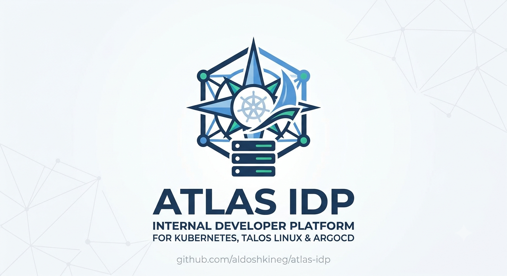
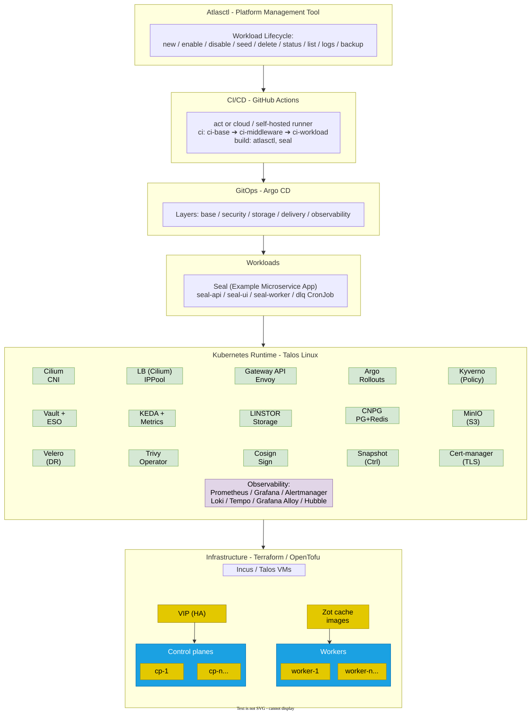

<p align="center">
  
</p>

# Atlas IDP

**Internal Developer Platform — GitOps-driven Kubernetes platform engineering on self-hosted infrastructure**


**Atlas IDP** is a production-grade Internal Developer Platform demonstrating modern platform-engineering practices on self-hosted Kubernetes — **Talos Linux** on Incus VMs.

It combines Infrastructure as Code, GitOps delivery, developer self-service, a secure software supply chain, observability and disaster recovery into a single reproducible platform. Applications are onboarded through **atlasctl** (a Go CLI), while Argo CD continuously reconciles platform and workload state; **seal** — a Helm-packaged microservice (API + UI + worker) — serves as the reference workload.

## Why Atlas?

Key engineering goals:

- GitOps-driven platform delivery — App-of-Apps, sync waves, progressive delivery
- Infrastructure as Code end to end — Terraform/OpenTofu → Incus → Talos
- Developer self-service via `atlasctl` golden paths
- Secure software supply chain — image signing, admission policies, scanning
- High availability & disaster recovery — replicated storage, cluster and DB backups
- Full observability stack (metrics, logs, traces) verified by e2e platform tests in CI

## Table of Contents

- [Architecture](#architecture)
- [Tech Stack](#tech-stack)
- [Repository Structure](#repository-structure)
- [Quick Start](#quick-start)
- [Testing](#testing)
- [Atlasctl](#atlasctl)
- [Example Workload](#example-workload)
- [Security & Policy](#security--policy)
- [Roadmap](#roadmap)

---

## Architecture



---

> How the LB/VIP and replicated storage actually work (verified live):
> [`docs/cluster-internals.md`](docs/cluster-internals.md).

## Tech Stack

| Capability              | Tools we provide                                                                            |
| ----------------------- | ------------------------------------------------------------------------------------------- |
| Infrastructure as Code  | Terraform, OpenTofu                                                                         |
| Virtualization / Host   | Incus VMs                                                                                   |
| OS / Kubernetes         | Talos Linux, Kubernetes v1.34                                                               |
| CNI + Networking (eBPF) | Cilium — CNI, kube-proxy-less, Gateway API, L2/L3 LB, network policies, Hubble              |
| CSI / Storage           | LINSTOR / Piraeus (replicated block, DRBD), snapshot-controller                             |
| GitOps                  | Argo CD (App-of-Apps), Argo Rollouts (canary / progressive delivery)                        |
| CI/CD                   | GitHub Actions (self-hosted runner), act                                                    |
| Secrets Management      | HashiCorp Vault, External Secrets Operator (ESO)                                            |
| Policy & Supply Chain   | Kyverno (admission / policy), Cosign (image signing & verification), Trivy / Trivy Operator |
| TLS / PKI               | Cert-manager (issuing / rotating TLS)                                                       |
| Observability           | Prometheus, Grafana, Alertmanager, Loki, Tempo, Grafana Alloy, Hubble                       |
| Databases & Storage     | CloudNativePG (PostgreSQL), Redis (HA), MinIO (S3-compatible)                               |
| Autoscaling             | KEDA (event-driven), metrics-server (HPA)                                                   |
| Backup / DR             | Velero, CloudNativePG (Barman → MinIO/S3)                                                   |
| Platform Tooling        | Atlasctl (Go CLI — golden-path workload onboarding), Zot (registry pull-through cache)      |
| Sample Workload         | Seal — api / ui / worker / DLQ CronJob (Helm-packaged)                                      |
| Languages               | Go, HCL, YAML, Shell                                                                        |

---

## Repository Structure

```
atlas-idp/
├── infra/          # Infrastructure as Code — Terraform/OpenTofu (environments, modules)
├── gitops/         # Argo CD manifests: platform layers (base/storage/security/…) + workloads
├── workloads/      # Per-tenant workload definitions (atlasctl registry)
├── apps/           # Application source + Helm charts (seal)
├── tools/          # atlasctl (Go CLI) and workflow scripts
├── security/       # CA certs, RBAC, Trivy, Cosign keys
├── tests/          # Platform smoke/integration tests (make test)
├── templates/      # Golden-path workload templates (atlasctl scaffold source)
├── recipes/        # Cluster snippets (standalone kubectl apply, outside GitOps)
├── docs/           # Documentation
└── Makefile        # Developer + CI workflow targets
```

All documentation is indexed in [`docs/README.md`](docs/README.md). Key entry points: [`docs/tech-stack.md`](docs/tech-stack.md) (technology inventory), [`docs/setup.md`](docs/setup.md) (getting started), [`docs/adr/`](docs/adr/README.md) (architecture decisions), [`docs/runbooks/`](docs/runbooks/) (operations).

---

## Quick Start

### Prerequisites

- [Incus](https://linuxcontainers.org/incus/) (local VM host for Talos nodes) v7.2
- [Terraform](https://www.terraform.io/) / [OpenTofu](https://opentofu.org/) v1.15+
- [talosctl](https://www.talos.dev/) and [kubectl](https://kubernetes.io/docs/tasks/tools/) v1.31+
- [Docker](https://www.docker.com/) (for the CI runner / `act`) v29.5.2
- [Helm](https://helm.sh/), [Argo CD CLI](https://argo-cd.readthedocs.io/), [pre-commit](https://pre-commit.com/)

### 1. One-time Getting Started

To confirm the required tools are installed and variables/secrets are in place, run:

```bash
make preflight    # verify binaries, daemons, .env
```

See [`docs/setup.md`](docs/setup.md) for the full getting-started guide (tools, `.env`, CA, memory).

### 2. Minimal setup

Deployment runs through `act` (a local CI invocation). For the minimal set, run:

```bash
make act-stage-base         # Incus/Talos cluster + Argo CD + Vault seeds
```

### 3. Full deployment

For a full, production-like deployment with sample app, run:

```bash
make act-build          # build the local CI runner image (once) with pre-baked tooling
make act-ci             # ci-all: base ▶ middleware ▶ workloads
```

### 4. Tear down

```bash
make act-destroy    # destroy the stage infrastructure
make act-destroy-force  # hard teardown: kill all VMs and remove Terraform state files
```

> Pinned versions & host sizing: [`docs/requirements.md`](docs/requirements.md);
> replicated storage (LINSTOR/DRBD): [`docs/linstor.md`](docs/linstor.md); why Talos
> on Incus — [`ADR-001`](docs/adr/ADR-001-talos-incus.md).

---

## Access the platform

Services are exposed through the [Cilium Gateway](docs/cilium.md) (TLS via
[cert-manager](docs/ca.md)). Map the
gateway LoadBalancer IP to the `*.atlas` hostnames in `/etc/hosts`, then:

| Service       | URL                        |
| ------------- | -------------------------- |
| Argo CD       | `https://argocd.atlas`     |
| Grafana       | `https://grafana.atlas`    |
| Vault         | `https://vault.atlas`      |
| MinIO (S3)    | `https://s3.atlas`         |
| MinIO console | `https://console.s3.atlas` |
| Seal (Sample) | `https://seal.atlas`       |

> Dataplane choice: [`ADR-002`](docs/adr/ADR-002-cilium-dataplane.md). Trouble logging in?
> [`runbooks/argocd-grpc-login.md`](docs/runbooks/argocd-grpc-login.md),
> [`runbooks/cert-verification.md`](docs/runbooks/cert-verification.md).

---

## Testing

`make test` runs the platform smoke/integration suite (`tests/scripts/`); the same set is executed by the `test-platform.yaml` workflow:

| Test                  | Verifies                                              |
| --------------------- | ----------------------------------------------------- |
| `test-ca-gateway`     | Gateway API TLS termination end-to-end                |
| `test-vault`          | Vault seeding + secret injection                      |
| `test-network-policy` | NetworkPolicy isolation                               |
| `test-velero`         | [Velero](docs/velero.md) backup/restore to S3         |
| `test-keda`           | [KEDA](docs/scaling.md) autoscaling                   |
| `test-redis`          | Redis connectivity/auth                               |
| `test-db-backup`      | [CloudNativePG](docs/cnpg.md) backup/restore to MinIO |
| `test-argocd-rollout` | Argo Rollouts canary progression                      |
| `test-seal`           | seal end-to-end (pods, API, documents, gateway)       |

> Quick cluster triage — [`runbooks/cluster-health.md`](docs/runbooks/cluster-health.md).

---

## Workflow (Makefile Targets)

The Makefile is a thin task dispatcher: every target delegates to a script under
`tools/` and is **self-documenting**. Run `make` (or `make help`) to print the
full, grouped target list with descriptions and required arguments.

> The active workflow is [Incus](docs/incus.md)/[Talos](docs/talos.md) via the `act-*` and `ci-runner-*` targets.

---

## CI/CD Pipeline

CI runs as [GitHub Actions workflows](docs/ci.md) (`.github/workflows/`): `ci-all`, `security`
and the unit-test workflows trigger on push and pull_request (unit tests are
path-filtered), release workflows trigger on tags, while the stage pipelines
(`ci-base` / `ci-middleware` /
`ci-workload` / `ci-destroy` / `ci-destroy-force`) and `test-platform` can also
be launched manually via `workflow_dispatch`. The stage workflows are reusable
building blocks called by `ci-all` through `workflow_call`. The cluster persists
after a run (no auto-destroy). Locally, the equivalent is `make act-ci` (full
run) or the staged `make act-stage-*` targets.

> Registry pull-through cache: [`docs/zot.md`](docs/zot.md); failures —
> [`runbooks/ci-debugging.md`](docs/runbooks/ci-debugging.md).

---

## Atlasctl

The `atlasctl` binary is published in the project's GitHub Releases:
<https://github.com/aldoshkineg/atlas-idp/releases>.

```sh
curl -Lo atlasctl -L "https://github.com/aldoshkineg/atlas-idp/releases/latest/download/atlasctl-linux-amd64"
chmod +x atlasctl
sudo mv atlasctl /usr/local/bin/
```

[`atlasctl`](docs/atlasctl.md) is the platform management CLI for the
[workload lifecycle](docs/workloads.md): it scaffolds a
workload from templates, wires up its Gateway route, provisions Vault secrets and
generates the Argo CD Application — then enables, syncs, seeds and operates it.

```bash
atlasctl new   <app> --group <team> --repo <url> [--helm]           # scaffold
atlasctl enable <team>/<name> --force --sync                        # register + sync
atlasctl seed  <team>/<name>                                        # seed Vault secrets
atlasctl list                                                      # list workloads
```

> Locally the binary is built via `make atlasctl-build`; `make atlas-seal ARGS=<team>/<name>` is the same as `atlasctl seed`.

---

## Example Workload

[**Seal**](docs/seal.md) is the platform's reference tenant workload — a Helm-packaged microservice
(API + UI + worker) published to GHCR that signs PDFs with CMS/PAdES and verifies
them later.

- [](https://ghcr.io/aldoshkineg/seal-api) — REST API (CloudNativePG, Redis, MinIO, OTel → Tempo)
- [](https://ghcr.io/aldoshkineg/seal-ui) — web UI
- [](https://ghcr.io/aldoshkineg/seal-worker) — worker + DLQ CronJob

Source & chart: [`apps/seal`](apps/seal); image tags in [Packages](https://github.com/aldoshkineg/atlas-idp/packages).

The bundled **seal** workload (`apps/seal`, `workloads/atlasteam/seal`) is the
reference implementation, delivered via [GitOps](docs/gitops.md): PostgreSQL
(CloudNativePG) + Redis + MinIO,
[Argo Rollouts canary](docs/adr/ADR-003-argo-rollouts-managed-routes.md),
KEDA autoscaling, ExternalSecrets from Vault, a DLQ CronJob,
ServiceMonitors/alerts, OTel traces to Tempo, and a Cosign-signed image enforced
by Kyverno.

> Sync issues — [`runbooks/argocd-debugging.md`](docs/runbooks/argocd-debugging.md).

---

## Security & Policy

- **Policy-as-code:** [Kyverno](docs/security.md) admission policies (no `:latest`, no privileged/hostPath, non-root, standard labels).
- **Secrets:** [HashiCorp Vault](docs/vault.md) as the source of truth, synced by the [External Secrets Operator](docs/adr/ADR-004-vault-eso.md).
- **Supply chain:** images signed with [Cosign](docs/cosign.md) and verified at admission; Trivy Operator scans at runtime.
- **TLS:** cert-manager issues certificates from an internal CA for all Gateway listeners.

> Sealed Vault — [`runbooks/vault-troubleshooting.md`](docs/runbooks/vault-troubleshooting.md).

---

## Observability

- **Metrics:** [kube-prometheus-stack](docs/observability.md) (Prometheus + Alertmanager) with recording
  and alerting rules, including platform availability/capacity rules and
  per-workload alerts (e.g. `seal-alerts`).
- **Logs:** Loki + Grafana Alloy.
- **Traces:** Tempo (OpenTelemetry from workloads).
- **Dashboards:** Grafana (auto-provisioned).

---

## Roadmap

- **SSO** — OIDC (Dex/Keycloak) for Argo CD and Grafana.
- **Supply-chain attestations** — Sigstore/SLSA provenance verified in Kyverno.
- **Capacity & cost** — Kepler-based energy/cost reporting.
- **Multi-tenancy** — hierarchical namespaces + per-team quotas.
- **Multi-cluster** — Cilium ClusterMesh for cross-cluster service connectivity.
- **Docs site** — publish `docs/` as MkDocs Material / GitHub Pages.

---

## License

This project is open source and available under the [MIT License](LICENSE).
