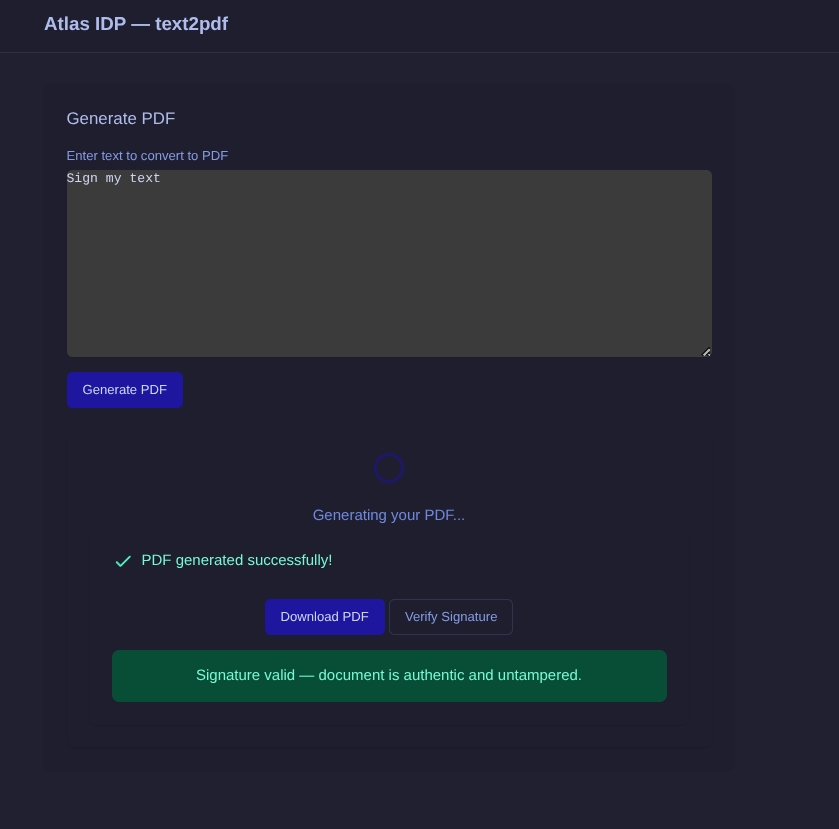
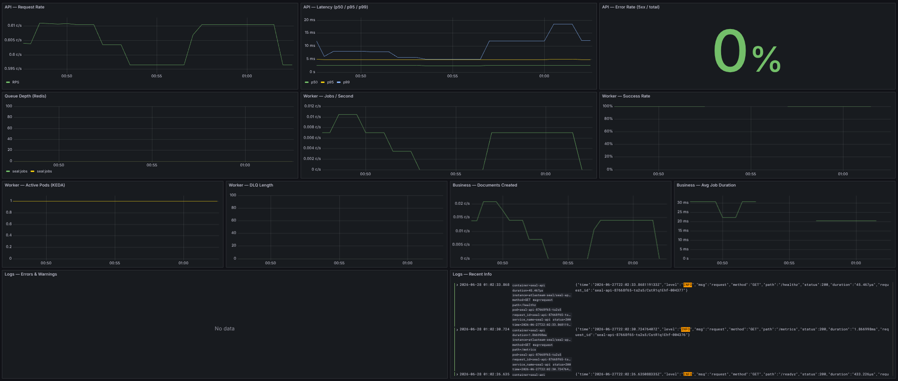
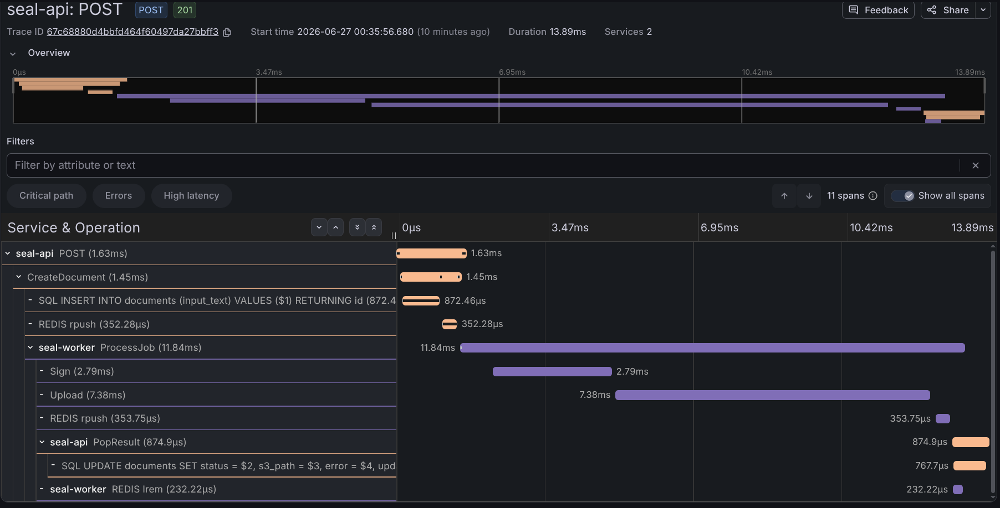

# Seal — PDF Signing & Generation Platform

A sample PDF signing and document generation workload for the Atlas IDP platform,
created specifically to exercise the project's workload tooling. It consists of a
REST API, an async worker, and a web UI, and is wired into the platform the same
way any tenant workload would be (atlasctl scaffolding, GitOps delivery, KEDA
autoscaling, observability).

- **seal-api** — REST API (Go, chi, pgx, Redis)
- **seal-worker** — PDF factory: reads jobs from Redis, generates PDFs, signs
  them with CMS/PAdES, uploads to MinIO
- **seal-ui** — Web frontend (Go + HTMX)

## Component diagram

```mermaid
flowchart TD
    GW[Gateway API<br/>nginx-gateway-fabric]
    UI[seal-ui<br/>Go + HTMX]
    API[seal-api<br/>Go, chi, pgx]
    PG[(PostgreSQL<br/>CNPG 17.6)]
    RD[(Redis<br/>seal:jobs / seal:results)]
    WK[seal-worker<br/>Go, gofpdf, pdfsign]
    MIN[(MinIO<br/>signed PDFs)]
    VAULT[(Vault<br/>sign cert)]

    GW -->|/| UI
    GW -->|/api| API
    UI --> API
    API --> PG
    API --> RD
    RD -->|BLMOVE (KEDA)| WK
    VAULT -->|cert| WK
    WK -->|upload| MIN
    MIN -->|303 redirect| GW
    WK -->|result| API

    subgraph OBS["Observability"]
        direction LR
        PROM[Prometheus] --> GRAF[Grafana]
        ALLOY[Alloy] --> TEMPO[Tempo] --> GRAF
    end

    UI -. metrics / traces .-> PROM
    API -. metrics / traces .-> PROM
    API -. traces OTLP/HTTP .-> ALLOY
    WK -. metrics / traces .-> PROM
    WK -. traces OTLP/HTTP .-> ALLOY

    classDef obs fill:#eef3fb,stroke:#6b8cc7;
    class PROM,GRAF,ALLOY,TEMPO obs;
```

## Data flow

1. User submits text in **seal-ui** → `POST /documents` → **seal-api**.
2. **seal-api** inserts a `pending` row in PostgreSQL and pushes a job to the
   `seal:jobs` Redis list.
3. **seal-worker** (scaled by KEDA off queue depth) pops the job, generates the
   PDF, signs it with the X.509 cert from Vault (prod) / file (dev), and uploads
   it to MinIO.
4. The worker pushes a result onto `seal:results`; **seal-api** consumes it and
   marks the document `completed` in PostgreSQL.
5. User downloads the signed PDF via **seal-ui** → `GET /documents/{id}/download`
   → 303 redirect through the Gateway to MinIO.

## Project structure

```
apps/seal/
├── seal-api/           # REST API (Go 1.26, chi, pgx, redis, minio-go)
│   ├── cmd/api/        # entrypoint
│   ├── internal/       # config, handlers, repository, queue, migrations
│   ├── migrations/     # SQL migrations (golang-migrate)
│   └── Dockerfile      # distroless (chainguard/static)
├── seal-worker/        # PDF generator + signer (Go 1.26, no PG access)
│   ├── cmd/worker/
│   ├── internal/       # config, worker, storage, pdf, signer
│   └── Dockerfile
├── seal-ui/            # Web UI (Go 1.26 + HTMX)
│   ├── cmd/ui/
│   ├── internal/       # server, handlers, client, templates
│   └── Dockerfile
├── charts/seal/        # Single Helm chart (api + worker + ui + routes)
├── tests/
│   ├── integration/    # testcontainers-go (real PG/Redis/MinIO)
│   └── load/           # k6 load scripts
├── doc/                # deep-dive docs (architecture, tracing, reports)
├── img/                # UI & monitoring screenshots
├── .env.example        # local dev configuration template
├── Taskfile.yml        # build / test / dc-up tasks
└── README.md           # this file
```

Each service is an independent Go module with its own `go.mod` and a
distroless image; all configuration is read from the environment only
(`go-envconfig`) so the same binary runs locally, in CI, and in the cluster.

## Screenshots

### Web UI

Text input, live status polling, and PDF download — server-rendered with HTMX.



### Monitoring — Application Overview

RPS, request latency (p50/p95/p99), error rate, queue depth, and worker replica
count, scraped from the built-in `/metrics` endpoints.



### Monitoring — Distributed Tracing

End-to-end traces (UI → API → Redis → Worker → MinIO) collected via
OpenTelemetry and stored in Tempo.



## Quick start

```bash
go-task dc-up        # Start all services via Docker Compose
go-task gen-certs    # Generate dev TLS certs (first time only)
```

The stack brings up PostgreSQL, Redis, and MinIO locally; run the API, worker,
and UI with `go-task run-api`, `go-task run-worker`, `go-task run-ui`.

## Development

- [Architecture & platform deep-dive](doc/architecture.md)
  — full component reference, secrets flow, KEDA/Gateway/Vault specifics.
- [Tracing design](doc/tracing.md)
- [Load test results](doc/load-test-results.md)
- [Argo Rollouts report](doc/argo-rollout-report.md)
- [Taskfile.yml](Taskfile.yml)
  — all available build, test, and run tasks.
