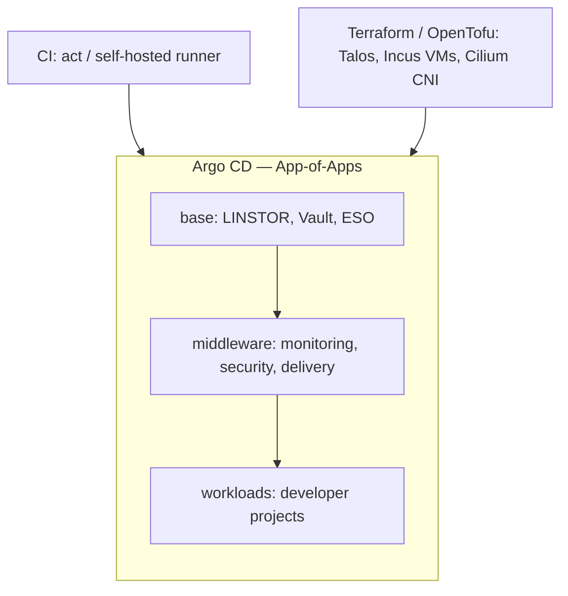
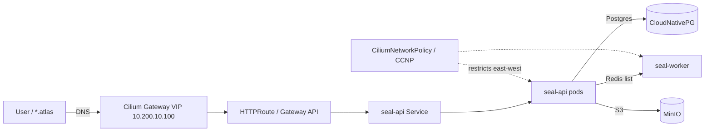
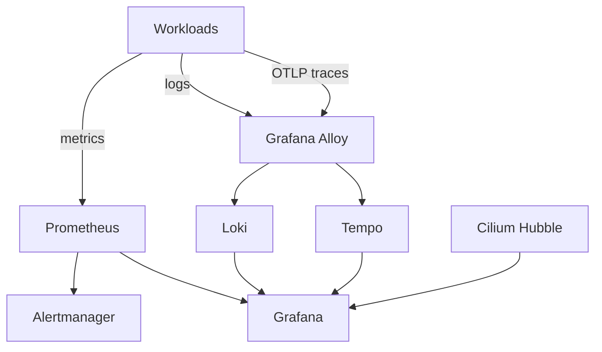
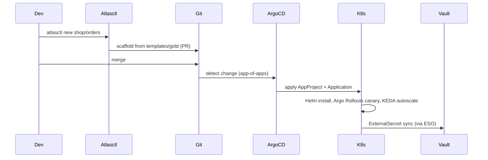

# Architecture & Flow Diagrams

> Mermaid diagrams for the platform. GitHub renders these natively; they pair
> with `system-prompt.md` and `tech-stack.md` as the visual layer of the CV
> showcase.

---

## 1. Infrastructure & Deployment Topology



---

## 2. CI/CD Pipeline

```mermaid
flowchart LR
  A[Push / PR] --> B[ci-base: tools + Terraform (Incus/Talos) + Argo CD bootstrap + Vault seeds]
  B --> C[ci-middleware: sync platform layers (base/storage/security/delivery/observability)]
  C --> D[ci-workload: seed + sync tenant workloads (seal)]
  D --> E[make test: platform e2e suites]
  B -.fail-fast.-> X[ci-destroy on error]
```

Run locally via `act` on a self-hosted runner; phases are `act-stage-base`,
`act-stage-middleware`, `act-stage-workload`.

---

## 3. Secrets Flow (Vault → External Secrets → Workload)

```mermaid
flowchart TB
  VB[Vault (tools/vault bootstrap)] -->|Kubernetes auth| VA[VaultAuth / VaultAuthMethod]
  VA -->|issuses short-lived token| ESO[External Secrets Operator]
  ESO -->|sync| ES[ExternalSecret]
  ES -->|creates| KS[Kubernetes Secret]
  KS -->|mounted / env| P[seal pods]
  KYV[Kyverno: require-image-signature] -.admission gate.-> P
```

Nothing secret is committed; images must be Cosign-signed and are verified at
admission by Kyverno.

---

## 4. Network Flow (Ingress → Service → Backend)



The VIP is announced by Cilium LB IPAM via L2 (ARP); no cloud LB / MetalLB.

---

## 5. Observability Stack



---

## 6. Workload Onboarding (self-service sequence)


